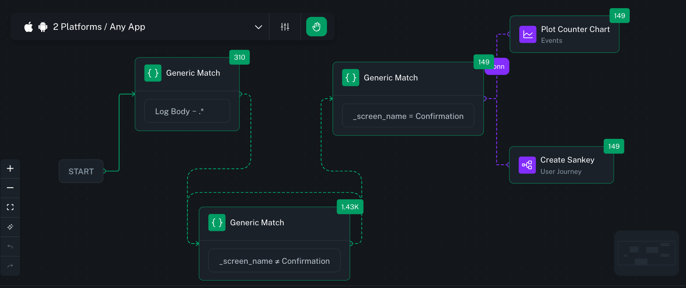
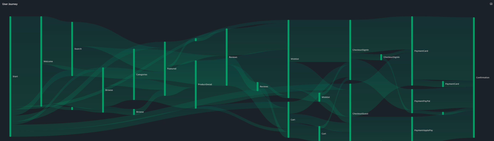

# Support Sankey Demo SDK (Android)

A demo Android application showcasing [bitdrift's](https://bitdrift.io/) mobile observability capabilities for support workflows. Demonstrates [user journey visualization](https://bitdrift.io/feature/user-journeys), device linking via temporary device codes, and session-level debugging.

> Learn more: [Documentation](https://docs.bitdrift.io/) | [SDK Quickstart](https://docs.bitdrift.io/sdk/quickstart) | [Blog](https://blog.bitdrift.io/)

## Screenshots

### Bitdrift Workflow Configuration



### Resulting Sankey Diagram



## What This Demo Does

Each app simulates an e-commerce journey with branching paths (browse, search, product detail, cart, checkout, payment, confirmation). Every screen logs a screen view event so the bitdrift dashboard can visualize the full journey as a Sankey diagram.

## Project Layout

```
android/
    bitdrift-sdk-instrumented/
        sankey-demo-sdk/
        support-sankey-demo-sdk/
    no-sdk/
        sankey-demo-no-sdk/
        sankey-demo-no-sdk-w-force/
        sankey-demo-no-sdk-w-quits/
ios/
    bitdrift-sdk-instrumented/
        sankey-demo-sdk/
        support-sankey-demo-sdk/
    no-sdk/
        sankey-demo-no-sdk/
        support-sankey-demo-no-sdk/
react-native/
    sankey-demo-no-sdk/
```

## App Variants

- SDK instrumented: ready-to-run examples integrated with the bitdrift SDK.
- No-SDK: baseline projects without bitdrift integration for comparison or custom wiring.
- Support apps: auxiliary builds used in the demo flow and testing.

## Where To Start

- Android (SDK): ../sankey-demo-sdk/
- iOS (SDK): ../../../ios/bitdrift-sdk-instrumented/sankey-demo-sdk/
- React Native (No-SDK): ../../../react-native/sankey-demo-no-sdk/

Each platform folder contains its own README with setup and run instructions.

## Concept Summary

The demo logs screen views for a fixed set of screens. These events are grouped into user sessions and rendered in the bitdrift dashboard as a Sankey diagram that highlights the most common paths and drop-offs.

## Bitdrift SDK Integration

### 1. Add Dependencies

In `app/build.gradle.kts`, add the SDK dependency (see [bitdrift releases](https://github.com/bitdriftlabs/capture-android/releases) for current version):

```kotlin
dependencies {
    // bitdrift SDK
    implementation("io.bitdrift:capture:<current-version>")
}
```

### 2. Add Gradle Plugin (Optional)

For automatic network instrumentation and proguard mapping uploads, add the plugin:

```kotlin
plugins {
    id("io.bitdrift.capture-plugin") version "<current-version>"
}
```

### 3. Initialize the SDK

In your `Application` class (`SankeyDemoApp.kt`), initialize the logger at startup:

```kotlin
import io.bitdrift.capture.Capture.Logger
import io.bitdrift.capture.providers.session.SessionStrategy

class SankeyDemoApp : Application() {
    override fun onCreate() {
        super.onCreate()

        // bitdrift
        Logger.start(
            apiKey = "<your-api-key>",
            sessionStrategy = SessionStrategy.Fixed(),
        )

        // Initialize support log field as disabled
        Logger.addField("supportlog", "false")
    }
}
```

**Configuration:**
- **Session Strategy:** `SessionStrategy.Fixed()` - maintains consistent session tracking
- Get your API key from Company Settings in the bitdrift dashboard

## Logging Implementation

### Bitdrift SDK Methods

The Capture SDK provides these logging methods on the `Logger` class:

| Method | Description |
|--------|-------------|
| `Logger.logScreenView(screenName)` | Logs screen view events for user journey tracking |
| `Logger.logInfo(fields?, throwable?) { message }` | Info-level log (message is a trailing lambda) |
| `Logger.logDebug(fields?, throwable?) { message }` | Debug-level log (message is a trailing lambda) |
| `Logger.logWarning(fields?, throwable?) { message }` | Warning-level log (message is a trailing lambda) |
| `Logger.addField(key, value)` | Adds a global field attached to every log |
| `Logger.createTemporaryDeviceCode(completion)` | Generates a temporary device code for dashboard linking |

### ScreenLogger Wrapper

This app uses a centralized `ScreenLogger` object (`ScreenLogger.kt`). Only `logScreenView` calls the bitdrift SDK; the other methods (`logInfo`, `logSimulationStart`, etc.) log to Android's local `Log.d` only:

```kotlin
object ScreenLogger {
    fun logScreenView(screenName: String) {
        // bitdrift SDK
        BitdriftLogger.logScreenView(screenName)

        Log.d(TAG, "_screen_name: $screenName")
    }

    fun logInfo(message: String, fields: Map<String, String> = emptyMap()) {
        // local log only (does not call bitdrift SDK)
        printLog("INFO", message, fields)
    }

    fun logSimulationStart(runs: Int) { ... }
    fun logSimulationEnd(runs: Int) { ... }
}
```

All screens use the `ScreenContainer` composable which automatically logs screen views via `DisposableEffect`:

```kotlin
@Composable
fun ScreenContainer(screenName: String, ...) {
    DisposableEffect(screenName) {
        ScreenLogger.logScreenView(screenName)
        onDispose { }
    }
    // ... UI content
}
```

### Logged Events

#### App Lifecycle Events (local log only)

These events are logged via Android's `Log.d`/`Log.w` in `AppLifecycleCallbacks.kt`. They do **not** go through the bitdrift SDK (unlike the iOS version which sends these to bitdrift):

| Event | Trigger |
|-------|---------|
| `app_open` | First activity started (foreground) |
| `app_close` | Last activity stopped (background) |
| `memory_pressure` | Memory running low |
| `low_memory` | Critical memory warning |

#### User Journey Screen Views (sent to bitdrift)

The app tracks navigation through an e-commerce flow. Each screen logs via `logScreenView()`, which calls the bitdrift SDK:

| Step | Screen Name | Description |
|------|-------------|-------------|
| 1 | `Welcome` | App entry point |
| 2 | `Browse` | Browse products |
| 2 | `Search` | Search products |
| 3 | `Featured` | Featured products |
| 3 | `Categories` | Product categories |
| 4 | `ProductDetail` | Product details |
| 4 | `Reviews` | Customer reviews |
| 5 | `Cart` | Shopping cart |
| 5 | `Wishlist` | Saved items |
| 6a | `CheckoutGuest` | Guest checkout |
| 6a | `CheckoutSignIn` | Member checkout |
| 6b | `PaymentCard` | Credit card payment |
| 6b | `PaymentApplePay` | Apple Pay payment |
| 6b | `PaymentPayPal` | PayPal payment |
| 7 | `Confirmation` | Order confirmation |

#### Simulation Events (local log only)

The app includes a simulation mode for generating test data. **Each simulated journey generates a new session ID** via `Logger.startNewSession()`, allowing you to track individual user journeys separately in the bitdrift dashboard.

These events are logged via `ScreenLogger.logInfo` which writes to Android's `Log.d` only (not sent to bitdrift):

| Event | Fields | Description |
|-------|--------|-------------|
| `simulation_start` | `total_runs` | Fixed simulation begins |
| `simulation_end` | `total_runs` | Simulation completes |
| `simulation_cancelled` | `completed_runs`, `total_runs` | User cancels |
| `infinite_simulation_start` | - | Infinite mode begins |
| `infinite_simulation_end` | `total_runs` | Infinite mode ends |

### Support Features

The Welcome screen includes two support buttons for live debugging with bitdrift:

#### Device Code

Generates a temporary device code via `Logger.createTemporaryDeviceCode()`. The code is copied to the clipboard and can be shared with support to stream logs from the device in real time:

```bash
bd tail devicecode:<code>
```

#### Support Log

Toggles a global log field `supportlog` between `"true"` and `"false"` using `Logger.addField(key, value)`. This field is attached to every log emitted by the SDK, allowing bitdrift workflows to detect support sessions and trigger enhanced recording (e.g., higher fidelity captures, longer retention).

The field is initialized to `"false"` at app startup. When the user taps the button it flips to `"true"`, and tapping again resets it to `"false"`.

```kotlin
// Toggling the field
Logger.addField("supportlog", "true")  // enable
Logger.addField("supportlog", "false") // disable
```

## Project Structure

```
app/src/main/java/com/example/sankey_demo/
├── SankeyDemoApp.kt      # Application class with bitdrift initialization
├── ScreenLogger.kt       # Centralized logging wrapper
├── Screen.kt             # Navigation routes (sealed class)
├── Screens.kt            # All screen composables
├── Components.kt         # Reusable UI components (ScreenContainer)
├── MainActivity.kt       # Main activity with NavHost
├── SimulationManager.kt  # Automated journey simulation
└── AppLifecycleCallbacks.kt # App lifecycle event logging
```

### Dependencies

The project uses the [capture-android](https://github.com/bitdriftlabs/capture-android) SDK via Gradle. Current version: `0.22.5`.

### Usage Example

```kotlin
// Log a screen view
ScreenLogger.logScreenView("ProductDetail")

// Log with custom fields
ScreenLogger.logInfo(
    "simulation_start",
    mapOf("total_runs" to "100")
)
```

## Requirements

- Android API level 26+ (minSdk)
- Kotlin
- Jetpack Compose
